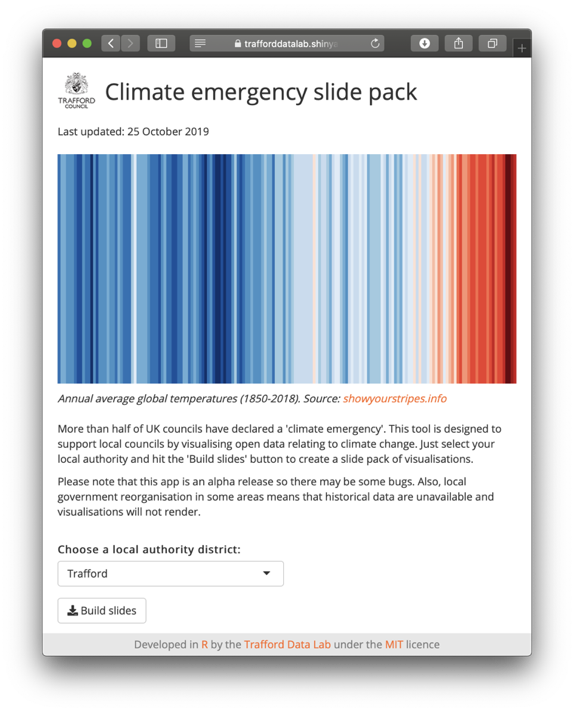
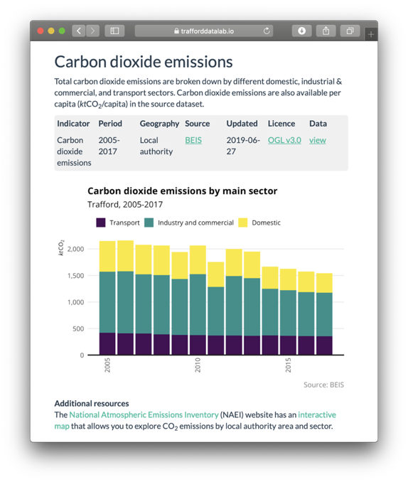

# Climate emergency
This repository contains resources to make open data relating to climate change more discoverable for local councils declaring a <a href="https://www.bbc.co.uk/news/newsbeat-47570654" target="_blank">'climate emergency'</a>.

### Slide pack
This web application built using <a href="https://cran.r-project.org" target="_blank">R</a> <a href="https://shiny.rstudio.com" target="_blank">Shiny</a> allows users to select a UK local authority and generate a slide pack containing visualisations about climate change that are relevant to their area.  

<a href="https://trafforddatalab.shinyapps.io/climate_emergency" target="_blank">Link to app</a>

### Open data companion
This page is a curated list of open datasets relating to climate change at a local authority level. Links to structured datasets for each UK local authority (where available) are provided following a [common standard](schema.md).

<a href="https://www.trafforddatalab.io/climate_emergency" target="_blank">Link to open data companion</a>
